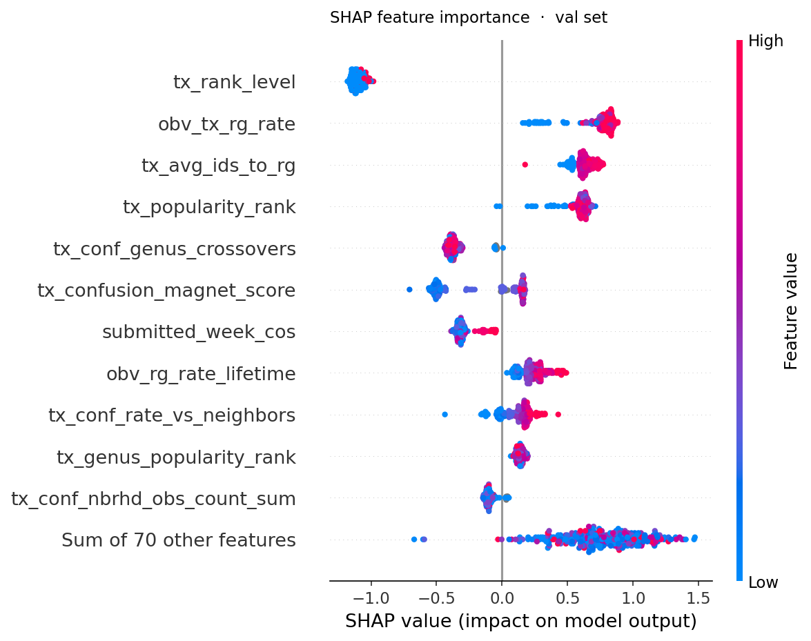
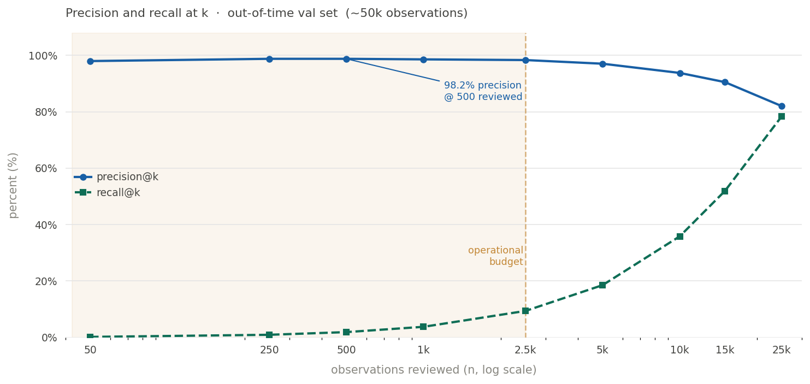

# inat-obs-scorer

> **Expert Review Prioritization Engine for iNaturalist**
> *Which "Needs ID" observations are most likely to reach Research Grade — and should be reviewed first?*

[](https://www.python.org/)
[](https://lightgbm.readthedocs.io/)
[](https://mlflow.org/)
[](https://duckdb.org/)
[]()

---

## Overview

iNaturalist accumulates millions of wildlife observations submitted by citizen scientists. A subset of these earn **Research Grade (RG)** status — a quality threshold that makes observations useful for biodiversity science. Getting there requires community taxon agreement from knowledgeable identifiers, but expert attention is a scarce resource.

This project builds a **binary classifier** that scores each open "Needs ID" observation on its probability of reaching Research Grade, enabling triage of expert review queues. It is currently scoped to the plant kingdom (*Plantae*) in Québec and is designed as a production-style ML system.

**Highlights:** temporal-safe label re-derivation from iNaturalist's identification
algorithm · Bayesian-shrunk taxon difficulty features · Protocol-based async enrichment
pipeline · 98.2% precision at 500 observations reviewed · ROC-AUC 0.88 on out-of-time val set.

### Problem framing

```
Observer quality      → How reliable is this observer's documentation?
Identifier quality    → How knowledgeable are the identifiers involved?
Taxon difficulty      → How much community attention does this species require?
Community consensus   → What has the community already signalled?
                                        ↓
                           P(Research Grade) score
```

The core modelling challenge is **temporal**: all features must be reconstructed at the exact moment of each observation, and the label itself must be derived from a point-in-time simulation of iNaturalist's identification algorithm — not the current scraped state.

---

## Architecture

```
[Raw Source]
    iNaturalist open data export (CSV) + targeted API scraping
          ↓
[Ingestion Layer]
    Async API client — rate-limited, fault-tolerant, Protocol-based
    DuckDB as single source of truth
          ↓
[Feature Engineering Layer]
    SQL-heavy transforms in DuckDB
    Point-in-time windowed features — no temporal leakage
          ↓
[Label Engineering]
    Community taxon re-derived via DuckDB table macro
    Research Grade label computed from windowed identification history
          ↓
[Training Dataset]
    Hard temporal split with gap buffers (train / val / test)
    Closed-window binary label: RG status at obs_date + 90 days
          ↓
[Model Training]
    Modular scikit-learn Pipeline with registry-pattern components
    LightGBM + Optuna hyperparameter search + MLflow tracking
          ↓
[Explainability]
    SHAP value analysis logged as MLflow artifacts
          ↓
[Serving Layer]  ← (v0.3)
    FastAPI  POST /score → { observation_id, rg_probability, rank }
```

---

## Key Engineering Decisions

### 1. Temporal leakage — four distinct risk vectors

Most ML pipelines guard against one form of leakage. This project explicitly identifies and addresses four:

| Vector | Risk | Mitigation |
|---|---|---|
| **Label leakage** | Scraped `quality_grade` reflects current state, not state at prediction time | RG label re-derived from windowed identification history via DuckDB table macro |
| **Feature leakage** | Aggregating observer/taxon stats across the full dataset contaminates past observations with future signal | All window functions bounded to `created_at` |
| **Split leakage** | Shuffling within temporal partitions destroys gap buffer integrity | Hard date-range boundaries from `SplitConfig`; val/test rows ordered by `created_at`, never shuffled |
| **CV split leakage** | Standard K-fold with shuffling violates temporal structure, producing optimistically biased estimates | Custom `ExpandingWindowCvSplit(BaseCrossValidator)` — equal-chunk expanding window, sklearn-compatible, with a `gap_size` hook designed in; gap buffer not yet active — see [Scope & Limitations](#scope--limitations) |

### 2. Research Grade — a two-stage label

Research Grade is not simply a community consensus signal. It is a compound label with two distinct requirements, both re-derived here from windowed identification history:

**Stage 1 — Community taxon** ([iNaturalist docs](https://help.inaturalist.org/en/support/solutions/articles/151000173076))

The community taxon is computed via a taxonomic tree traversal. At each node, the algorithm scores cumulative agreement against disagreement including ancestor disagreements, and requires a 2/3 supermajority with at least 2 identifications. This project re-implements the algorithm as a **DuckDB table macro** (`community_taxon_windowed(eval_interval)`) parameterized by evaluation timestamp:

```sql
-- cumulative_agreement / (agreements + disagreements + ancestor_disagreements) ≥ 2/3
-- Minimum 2 identifications required at the agreed node
```

**Stage 2 — Research Grade eligibility** ([iNaturalist docs](https://help.inaturalist.org/en/support/solutions/articles/151000169936))

Community taxon is necessary but not sufficient. An observation also requires a verifiable media record (photo or sound), geolocation, a date, and must not be captive or cultivated. The community taxon must additionally reach species level or lower, and the observation taxon must agree. The `research_grade_windowed()` wrapper enforces all conditions and surfaces `is_rg` as the training label — replacing the scraped `quality_grade` column entirely.

### 3. Taxon difficulty with Bayesian shrinkage and hierarchical fallback

Rare taxa have too few observations to compute a reliable RG rate. A naive approach either drops them or overfits to small samples. This project uses:

- **Bayesian shrinkage** (α = 10) to blend the taxon-specific rate toward the global prior
- **Hierarchical fallback**: species → genus → family → order → global mean, applied when the shrunk estimate is still unreliable
- All rates computed **point-in-time** on the training partition only, then applied to val/test — never recomputed on the full dataset

### 4. Species confusion graph features

Visually similar species create systematic misidentification patterns. The confusion graph, built with DuckPGQ, encodes:

- **Neighborhood difficulty**: how hard is the local species cluster to disambiguate?
- **Asymmetric sink flag**: is this taxon disproportionately the *recipient* of misidentifications from visually similar species?
- **Focal taxon rank within neighborhood**: where does this species sit in terms of identifier confidence?

### 5. Protocol-based async API client

The enrichment layer uses a fully async client designed around Python `Protocol` interfaces rather than inheritance, keeping fetchers and writers decoupled and independently testable.

```
BatchEndpointClient        — fixed-set ID requests, bulk pagination
ParametrizedEndpointClient — flexible endpoint/param formatting per call

asyncio.Queue              — bridges fetch workers and the write thread
ThreadPoolExecutor(max_workers=1) — serializes DuckDB writes from async context
Exponential backoff + jitter — handles iNaturalist rate limiting gracefully
_resolve_id cascade        — flexible ID field mapping across endpoint shapes
```

### 6. Modular scikit-learn pipeline with registry pattern

Each pipeline stage (imputer, encoder, scaler, reducer, classifier) is registered by name and resolved at runtime from CLI arguments, enabling clean experiment configuration without code changes:

```bash
inat_pipe train \
  --classifier lightgbm \
  --imputer median \
  --encoder onehot \
  --scaler robust \
  --reducer none \
  --n_trials 50 \
  --cv_folds 5
```

---

## Feature Groups

| Group | Features |
|---|---|
| **Observer history** | Historical RG rate (actual vs. expected), total obs count, account tenure, taxon diversity |
| **Observation documentation** | Photo count, presence of notes, coordinate uncertainty |
| **Taxon context** | Taxon rank, RG rate with Bayesian shrinkage, hierarchical fallback chain |
| **Identification dynamics** | Number of IDs received, agreement rate |
| **Confusion graph** | Neighborhood difficulty, sink-species flag, focal taxon rank in cluster |
| **Temporal** | Day of year, hour of submission, time elapsed since submission |




---

## ML Stack

| Concern | Tool |
|---|---|
| Storage & transforms | DuckDB (SQL-first, no ORM) + DuckPGQ |
| Pipeline composition | scikit-learn `Pipeline` |
| Model | LightGBM |
| Hyperparameter search | Optuna (fANOVA importance logged to MLflow) |
| Experiment tracking | MLflow (params, metrics, artifacts, model registry) |
| Explainability | SHAP (feature importance, beeswarm plots) |
| Data versioning | DVC |
| Validation *(v0.3)* | Pydantic models for config and schema enforcement |
| Serving *(v0.3)* | FastAPI |

**Current performance**: ROC-AUC **~0.88** on out-of-time val set.

---

## Ranking Performance

ROC-AUC measures discrimination globally, but the operational question is different:
**given a fixed review budget, how precisely does the model surface genuine RG candidates?**

Expert identifier time is the scarce resource. The realistic daily capacity of a small
identifier team is in the hundreds of observations, not tens of thousands. The model is
evaluated accordingly.

| k (reviewed) | n | precision@k | recall@k | lift@k |
|---|---|---|---|---|
| 0.1% | 50 | 100.0% | 0.19% | 1.91× |
| 0.5% | 250 | 98.0% | 0.94% | 1.87× |
| **1%** | **500** | **98.2%** | **1.88%** | **1.88×** |
| 2% | 1,000 | 98.6% | 3.77% | 1.88× |
| 5% | 2,500 | 98.5% | 9.42% | 1.88× |
| 10% | 5,000 | 97.1% | 18.6% | 1.86× |
| 20% | 10,000 | 94.3% | 36.0% | 1.80× |
| 50% | 25,000 | 82.3% | 78.6% | 1.57× |

At 500 observations reviewed (1% of queue), **98.2% are genuine RG candidates** —
the model produces near-zero wasted expert effort in the operational budget range.
Precision stays above 98% all the way to 2,500 reviews; recall is the binding constraint
at this scale.




### What the metrics imply for next features

The lift curve flattens around 1.88× across the entire operational zone (50–2,500 reviews),
suggesting the model has saturated its current signal for the highest-confidence observations.
Gains at low-k will require features that better separate the *hardest true positives*
from *easy negatives* — the boundary cases the model currently hedges on. High-priority
feature directions:

- **ID velocity signals**: time-to-first-ID and identification burst patterns — fast early
  agreement is a strong prior for RG that current features don't directly encode
- **Observer × taxon interaction**: an observer's track record on *this specific taxon*,
  not just their global RG rate
- **Phenology alignment**: whether the observation date is consistent with expected
  seasonal occurrence for the taxon

## Data Pipeline CLI

```bash
pip install -e .
```

### Ingest

```bash
# Ingest from local export files
inat_pipe ingest local

# Enrich via iNaturalist API (async, rate-limited)
inat_pipe ingest api --rate 15 --ignore_not_found
```

### Feature engineering

```bash
inat_pipe features
```

### Train

```bash
inat_pipe train \
  --classifier lightgbm \
  --imputer median \
  --encoder onehot \
  --scaler robust \
  --n_trials 50 \
  --cv_folds 5
```

### Evaluate

```bash
# Final one-shot evaluation against the held-out test set
inat_pipe test
```

Reserved for a single terminal evaluation run. Outputs ROC-AUC and classification report against the held-out test partition — never used during model selection or feature iteration.

### Inference *(v0.3)*

```bash
inat_pipe inference --obs_id <id>
```

---

## Data Selection

Not all records in the raw iNaturalist export are suitable for training. Selection happens at two levels:

**Observation-level eligibility** — only verifiable observations are retained: georeferenced, dated, with media, non-captive. Casual and ineligible observations are excluded from the training set but preserved as a separate class for potential future modelling.

**Observer-level coverage** — observers must meet both:
- **Minimum activity**: ≥ 20 observations, ensuring a meaningful historical footprint for observer reputation features
- **Time coverage**: oldest observation before 2020 and newest after 2024, ensuring the observer's history spans the label window cleanly

---

## Split Strategy

Splits use hard date-range boundaries derived from a `SplitConfig` dataclass anchored on a single `cutoff_date`. Gap buffers between partitions prevent label-time contamination. Val and test sets are ordered by `created_at` to preserve temporal integrity.

```
[──── Train ────][gap][── Val ──][gap][─── Test ───]
  ~60%                  ~16%            ~24%
```

A natural positive-rate drift (57% → 52%) from train to val/test is expected and is not a sign of overfitting — it reflects the evolving composition of the iNaturalist community over time.

---

## Project Structure

```
inat_pipeline/
├── api/
├── app/
│   ├── container.py         # App dependencies
│   └── service.py           # App entry point
├── db/
│   ├── adapters/
│   │   └── duckdb_adapter.py
│   ├── protocols.py
│   └── sql.py
├── ingest/
│   ├── inat_client/
│   │   ├── base.py          # Async Protocol-based API client
│   │   ├── clients.py       # BatchEndpointClient, ParametrizedEndpointClient
│   │   ├── config.py
│   │   ├── factory.py
│   │   ├── fetchers.py      # RateLimiterFetcher
│   │   ├── protocols.py
│   │   ├── registry.py      # Specific endpoint fields
│   │   └── writers.py       # ThreadPoolExecutor-backed DuckDB writer
│   └── local/
│       ├── ingestors.py     # Expandable backend support *(v0.4)*
│       └── protocols.py
├── queries/                 # All .sql queries
│   ├── api/                 # Prep raw data receiving
│   ├── features/            # Features suite, injected via params CTE
│   ├── graph/               # Graph queries for taxa confusion, with DuckPGQ
│   ├── split/               # Train/Val/Test splits
│   ├── stage/               # Raw data staging
│   ├── params.py
│   └── registry.py
├── train/
│   ├── utils/
│   ├── config.py
│   ├── core.py
│   ├── explainability.py
│   ├── final.py
│   ├── objective.py
│   └── registry.py
├── utils/                   # Misc utils, logger, etc.
├── workflows/
│   ├── features_workflow.py
│   ├── ingest_api_observations_workflow.py
│   ├── ingest_api_similar_species_workflow.py
│   ├── ingest_api_workflow.py
│   ├── ingest_local_workflow.py
│   ├── test_workflow.py
│   └── train_workflow.py
├── exceptions.py            # Custom exceptions hierarchy
└── cli.py                   # Entrypoints: ingest / features / train / test / inference
```

---

## Roadmap

### ✅ v0.1 — Data pipeline and baseline
- ELT pipeline, DuckDB storage layer
- Basic feature engineering
- Logistic regression baseline

### ✅ v0.2 — Extended features and real model
- scikit-learn Pipeline with registry pattern
- LightGBM + Optuna + MLflow
- SHAP explainability
- Windowed community taxon and RG label re-derivation
- Bayesian shrinkage for taxon RG rates
- DVC for data versioning

### 🔲 v0.3 — System design and serving
- FastAPI inference endpoint (`POST /score`)
- Cold-start fallback paths via precomputed inference cache
- Run manifest and pipeline lineage table (idempotent retries)
- Schema drift assertions + lightweight feature versioning tied to MLflow runs
- Pydantic models for config and schema enforcement

### 🔲 v0.4 — Advanced features and routing
- SHAP evaluation at borderline observations with incorrect classification
- Additional feature directions:
  - Phenology alignment indicators
  - Observer × top-identifier expertise interaction term
  - Geographic range signal
- Survival model (time-to-RG)
- Rare species → expert routing
- AWS S3 ingestion source migration to facilitate scope expansion

---

## Scope & Limitations

- Currently scoped to **Plantae** observations in **Québec**
- Identifier-level features are not yet implemented; observer features serve as a proxy
- `taxon_avg_ids_to_rg` uses the final scraped ID count rather than a true point-in-time count, introducing mild upward bias for recent observations. The effect is partially attenuated by the `1 PRECEDING` window boundary and the front-loaded nature of iNaturalist identification activity
- CV fold boundaries do not include gap buffers — gap buffer logic is applied to the final train/val/test split only

---

*Built as a portfolio project modeled on a production ML team working within the iNaturalist ecosystem.*
