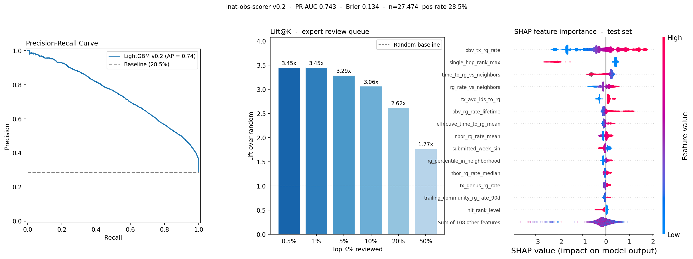
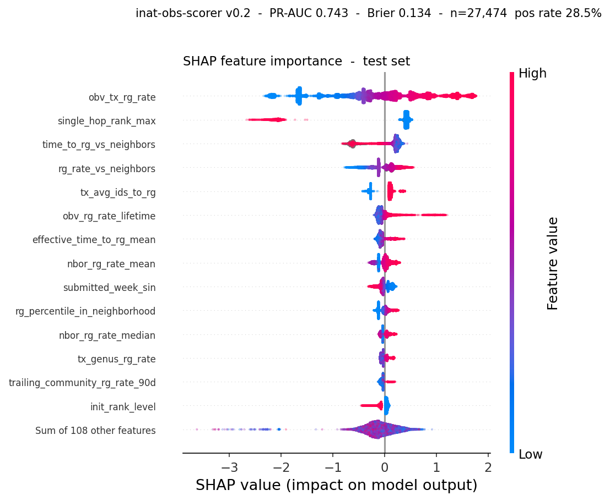
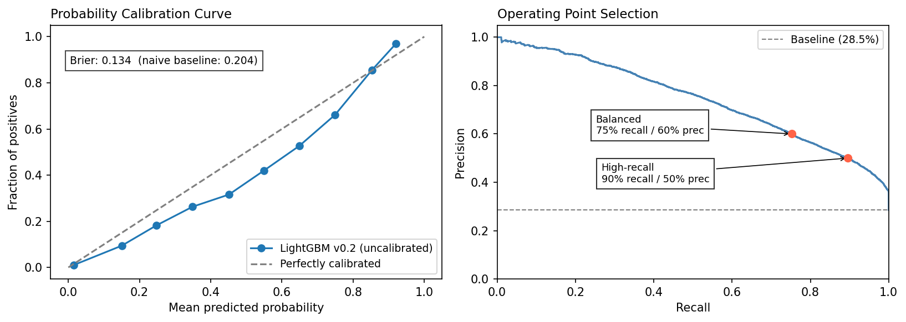

# inat-obs-scorer - Model Evaluation v0.2

**Task:**  Expert Review Prioritization Engine for iNaturalist   - will a Quebec Plantae Needs ID observation reach Research Grade within 365 days?

**Population:** Observations with no external identifications at day 7 (no-ID subpopulation)

**Test set:** 27,474 observations - 28.2% positive rate

---

## Setup

    Test set : 27,474 observations  |  positive rate: 28.5%
    PR-AUC   : 0.743  |  Brier: 0.134

## Ranking Metrics

<table id="T_befac">
  <thead>
    <tr>
      <th id="T_befac_level0_col0" class="col_heading level0 col0" >Top K%</th>
      <th id="T_befac_level0_col1" class="col_heading level0 col1" >N reviewed</th>
      <th id="T_befac_level0_col2" class="col_heading level0 col2" >Recall@K</th>
      <th id="T_befac_level0_col3" class="col_heading level0 col3" >Precision@K</th>
      <th id="T_befac_level0_col4" class="col_heading level0 col4" >Lift@K</th>
    </tr>
  </thead>
  <tbody>
    <tr>
      <td id="T_befac_row0_col0" class="data row0 col0" >0.5%</td>
      <td id="T_befac_row0_col1" class="data row0 col1" >137</td>
      <td id="T_befac_row0_col2" class="data row0 col2" >1.7%</td>
      <td id="T_befac_row0_col3" class="data row0 col3" >98.5%</td>
      <td id="T_befac_row0_col4" class="data row0 col4" >3.45x</td>
    </tr>
    <tr>
      <td id="T_befac_row1_col0" class="data row1 col0" >1%</td>
      <td id="T_befac_row1_col1" class="data row1 col1" >274</td>
      <td id="T_befac_row1_col2" class="data row1 col2" >3.4%</td>
      <td id="T_befac_row1_col3" class="data row1 col3" >98.5%</td>
      <td id="T_befac_row1_col4" class="data row1 col4" >3.45x</td>
    </tr>
    <tr>
      <td id="T_befac_row2_col0" class="data row2 col0" >5%</td>
      <td id="T_befac_row2_col1" class="data row2 col1" >1373</td>
      <td id="T_befac_row2_col2" class="data row2 col2" >16.4%</td>
      <td id="T_befac_row2_col3" class="data row2 col3" >93.9%</td>
      <td id="T_befac_row2_col4" class="data row2 col4" >3.29x</td>
    </tr>
    <tr>
      <td id="T_befac_row3_col0" class="data row3 col0" >10%</td>
      <td id="T_befac_row3_col1" class="data row3 col1" >2747</td>
      <td id="T_befac_row3_col2" class="data row3 col2" >30.6%</td>
      <td id="T_befac_row3_col3" class="data row3 col3" >87.4%</td>
      <td id="T_befac_row3_col4" class="data row3 col4" >3.06x</td>
    </tr>
    <tr>
      <td id="T_befac_row4_col0" class="data row4 col0" >20%</td>
      <td id="T_befac_row4_col1" class="data row4 col1" >5494</td>
      <td id="T_befac_row4_col2" class="data row4 col2" >52.5%</td>
      <td id="T_befac_row4_col3" class="data row4 col3" >74.9%</td>
      <td id="T_befac_row4_col4" class="data row4 col4" >2.62x</td>
    </tr>
    <tr>
      <td id="T_befac_row5_col0" class="data row5 col0" >50%</td>
      <td id="T_befac_row5_col1" class="data row5 col1" >13737</td>
      <td id="T_befac_row5_col2" class="data row5 col2" >88.7%</td>
      <td id="T_befac_row5_col3" class="data row5 col3" >50.6%</td>
      <td id="T_befac_row5_col4" class="data row5 col4" >1.77x</td>
    </tr>
  </tbody>
</table>

## Core Evaluation Plots

Two views of the same model: how well it ranks PR curve and lift.

# Shap evaluation plot

## Probability Calibration

LightGBM is systematically underconfident at this positive rate. Platt scaling is planned for v0.3.

